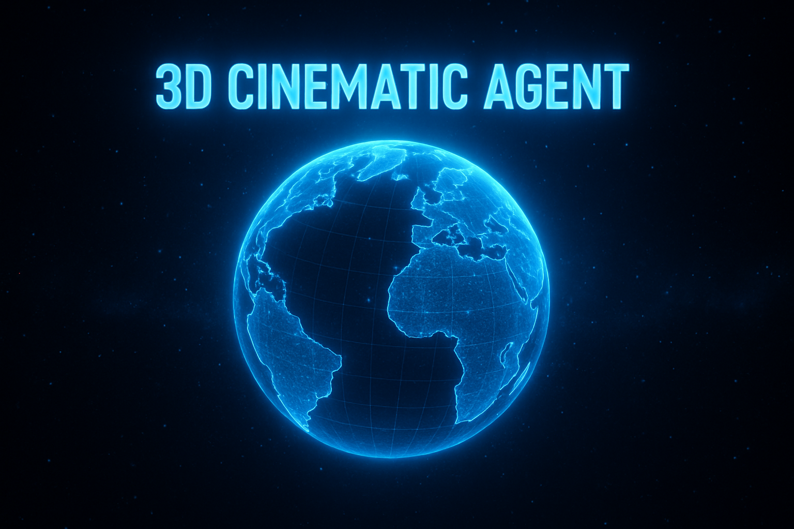

<p align="center">
  
</p>

<h1 align="center">🚀 3D Splats Cinematic Agent</h1>

<p align="center">
  <strong>Turn a 3D Gaussian Splat scene into a cinematic space-grade camera flythrough.</strong>
</p>

<p align="center">
  
  
  
  
</p>

---

## Introduction
This project provides a set of tools for working with Gaussian Splat scenes. It supports scene preview, camera path generation, object detection, and basic path planning. The goal is to offer practical utilities for analysis and video creation without relying on heavy 3D software.

## Features

### 🔍 Scene Preview
- Load and display .ply / Gaussian Splat scenes;
- Basic navigation for inspection;
- Scene noise filtering.

### 🎬 Video Generation
- Produce 30–120 second camera paths;
- Supports different scene types (indoor, outdoor);
- Generates stable trajectories suitable for rendering;
- Export camera motion for external tools.

### 🧭 Object Detection
- YOLO-based detection on rendered frames;
- Used for identifying additional points of interest in the scene.

### 📐 Path Planning
- Simple ML-based approaches (e.g., k-means) for deriving camera routes;
- Can generate trajectories based on scene structure.

## How to Launch

### 1. Clone
```sh
git clone https://github.com/lolyhop/3d-splats-cinematic-agent
cd 3d-splats-cinematic-agent
```

### 2. Install the dependencies

```sh
pip install -r requirements.txt
```

## Usage Guide

### Scene Preview

```sh
python -m src.renderer --scene_path <path_to_scene>
```

### Generate a fly-in

```sh
python src.main --scene_path <path_to_scene>
```
